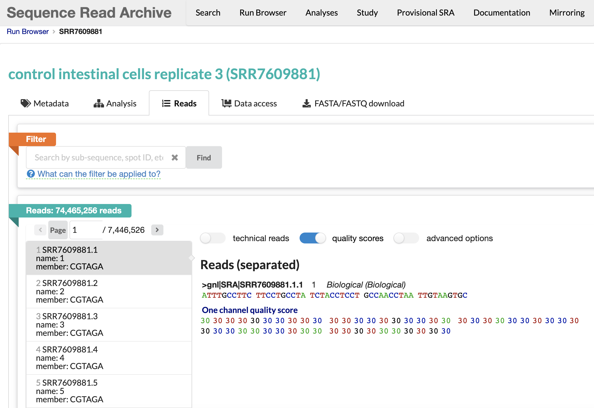

```{r setup, include=FALSE}
knitr::opts_chunk$set(echo = TRUE, error = TRUE, warning = FALSE)
```

---

Assignment 3 is due on **February 17, 2023**

---

**Instructions:** 

* Fetch the latest changes to this repo using GitHub desktop. You will need this assignment 3 document and the HW directory (you will be working out of here). 

* Please turn in the answers to this assignment as a knitted R markdown document. 
    + For this, dont forget to comment out all package installations after you install them! You dont want to keep installing things over and over! The same goes for loading a package with library(), just comment out when done.

* Answers will be graded for correctness, completeness, and how well the instructions are followed. 

* Turn in your assignment on canvas

```  
@ These are the learning objectives associated with each question
```

---

### QUESTION 1 (5 pts) 

```
@ Students will learn to search and obtain data from the SRA (sequence read archive)
```

Go to the [SRA website](https://www.ncbi.nlm.nih.gov/sra) and search for the data associated with the paper I mentioned in class, found [here](https://gut.bmj.com/content/early/2023/01/29/gutjnl-2022-328757.long). 

You will perform this search by searching with the Bioproject ID associated with this study, PRJEB56080. 

```{r echo=FALSE, out.width = "90%", fig.align = "center", message=FALSE}
install.packages("imager") # install this once and then comment it out, so that you dont continue to re-install the same package 
library(imager) # now load the package you just installed 

 
# make sure this relative path will work for you. if you clone the repo, then it work fine.
```

Now you should see information from the paper show up, including a link to the paper on Pubmed. You will also see Illumina MiSeq sequencing runs, each with a unique accession number. 

```{r}

```

Go ahead and click on the top Illumina MiSeq run. You should now see information regarding this run.  

Here, we can now click on the SRA accession number for this particular run (ERR10228758). 

```{r}

```

This has now taken us to the SRA run browser, with the Illumina Run data loaded. 

Go ahead and click on the FASTA/FASTQ download tab. Lets check it out. 

```{r}

```

So this is where we could go to download a particular run file as a FASTA file or FASTQ file. 

```
FASTA files and FASTQ files store sequence data and sequence metadata. 

* FASTA files have the following format: 
    + A header line starting with >, containing the sequence ID.
    + One or more lines that contain the sequence.

* FASTQ files have the following format: 
    + A header line starting with @, containing the sequence ID.
    + One or more lines that contain the sequence.
    + A new line starting with the character +, and being either empty or repeating the sequence ID.
    + One or more lines that contain the quality scores.
```

But what do we see? 

This run doesn't contain any sequencing data! WOOPS!

```{r}

```

Lets go back now to the page containing Illumina Run information for the run we selected. You can click [here](https://www.ncbi.nlm.nih.gov/sra/ERX9763720[accn]) if you are having trouble getting there. 

Now click on the 'All runs' button so we can see what metadata is available for this study. 

```{r}

```

Here, we see more information for the study, including all of the runs that were collected plus the study metadata. 

```{r}

```

Scroll through the page. What do we see? 

We see that they also collected information on participant IL-6 and CRP levels within the blood. 

Lets download this information and do some quick analaysis. Click on the **Metadata** button. 

```{r}

```

You should now have in your downloads folder a file called, 'SraRunTable.txt'. 

However, for this homework assignment and ease, we will be importing this metadata file from the HW directory in our repo (Its already provided, YAY!). 

Now lets import the metadata and check it out. 

```{r}
MetaData <- read.table('./HW/SraRunTable.txt', sep=",", header = T)
```

Here are some basic functions we can use to interrogate the data. I would suggest running through each line of code individually. 

```{r}
head(MetaData) # returns the first parts of the dataframe
summary(MetaData) # returns a summary of each variable in our dataframe
```

For the purposes of a quick analysis and graphing tutorial, lets extract the IL-6 and CRP numeric data. 

```{r}
# This code chunk is extracting the entire column of data labeled CRP into a new object called CRP
CRP <- MetaData$CRP
```

Now lets interrogate the CRP data

```{r}
# are there any NAs in the data? 
anyNA(CRP) 

# yes there is. 

# We could remove the NA with the code below but then that will make our vectors different lengths. We will just leave the NA in and control for it later down the line. 
# you can run the code below just to test it out though if you'd like. 
CRP_test <- CRP[!is.na(CRP)] # this removes the NAs. 


# Lets perform some basic descriptive statistics 
summary(CRP) # returns info on the spread of our data 
var(CRP, na.rm = T) # returns the variance 
# Here we have to control for the null value in our data using 'na.rm = T' otherwise the function wont report the info we want. 
sd(CRP, na.rm = T) # returns the standard deviation

# Lets check out some basic plots
plot(CRP) # returns a scatter plot of our data
hist(CRP) # returns a histogram of our data
boxplot(CRP) # returns a boxplot of our data 
```

Now it is your turn. Repeat the above steps but this time with the IL.6 data! 

Add your answers below. Your answers should be the functional code that when executed allows me to see the results! Also make sure that your document knits! 

---

### QUESTION 2 (5 pts) 

```
@ Students will search new data from the SRA, and download a FASTQ file
```

Similar to the steps above, please go to the SRA website and search this project ID, PRJNA482604.

This should lead you to a page that looks like this...

```{r}
knitr::include_graphics("./HW/Q2 SRA query results.png")
```

Go ahead and click on the 'control intestinal cells replicate 3' sample. 

You will now be taken to a new page that looks like this ...

```{r}

```

Here, click on the SRA run file associated with this sample (SRR7609881). 

This will lead you to the SRA run browser for this sample. 

Here, go ahead and download the FASTQ file for this sample. This may take some time as it is a large file. This file will go to your downloads directory. Once you have this file, place it into the **HW directory** that you will be working out of for this assignment (This way you dont have to change any paths)!

```{r}
# Use the following code to install the required packages, load the required packages, and import the FASTQ file into R. 

if (!require("BiocManager", quietly = TRUE))
    install.packages("BiocManager")

BiocManager::install("ShortRead")
library(ShortRead)

seq <- readFastq("./HW/SRR7609881.fastq.gz", pattern=character(0))

sread(seq) # returns sequence information 
quality(seq) # returns the Phred quality score 
# Phred-scaled quality score represents how confident we are in the assignment of each base call by the sequencer.
id(seq) # returns the read ID and length 
```
See these links for information on [Quality score encoding](https://support.illumina.com/help/BaseSpace_OLH_009008/Content/Source/Informatics/BS/QualityScoreEncoding_swBS.htm) and [what the score means](https://gatk.broadinstitute.org/hc/en-us/articles/360035531872-Phred-scaled-quality-scores). Here you will see that the ? = 30. 

You can also visualize this same information on the SRA run browser! Check it out. 

```{r}

```

Now lets analyze the sequence data we just imported.

```{r}
# here is one method
BiocManager::install("dada2")
library(dada2)
plotQualityProfile("./HW/SRR7609881.fastq.gz")


# here is another method. I like this one better. It seems to have more options in the package. 
BiocManager::install("Rqc")
library(Rqc)

qcRes = rqc(path="./HW/", pattern="fastq.gz", openBrowser=FALSE)
rqcCycleQualityBoxPlot(qcRes)
rqcReadQualityPlot(qcRes)
```

Though the output isn't super interesting, what conclusions can we make regarding this sample? 

```
Type your answer here:

```

---

### QUESTION 3 (10 pts) 

```
@ Students will demonstrate there knowledge by repeating the above steps independently, and completing a new SRA search. 
```

Now that you have an idea of how to navigate SRA and obtain data from SRA, complete a new search. 

You can search for whatever you like or that is of interest to you. Building a search can look like this ... 

```{r}

```

In this new search, you should download data of some type (i.e., sequence data or metadata) and perform some analysis. The analysis could be of a similar nature to what we have already done or could be brand new (i.e., something you look up)!

Put your code below:


---

### QUESTION 4 (5 pts) 

```
@ Students will learn about a specific R function of their choice, and impliment an example of its usage. 
```

Choose an R function you think is interesting and would like to learn more about. Also mention the R package it can be found in. 

Describe what the function does or how it can be used. 

Give a functional example of its use. I want to try it too. 

Also provide a link to some documentation describing this function. The **[NAME](url)** notation is used for creating a hyperlink. You can provide the link below by filling in the syntax: 

[Your website here]()
