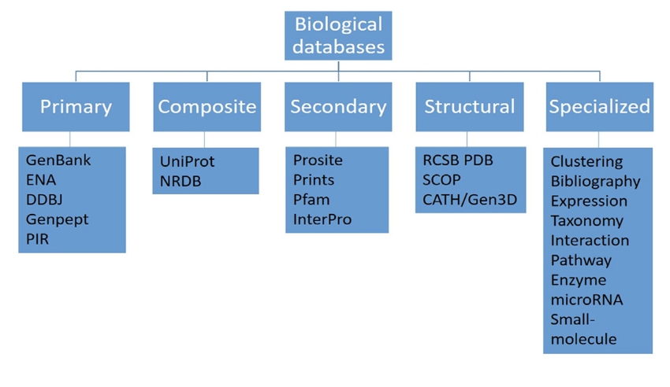
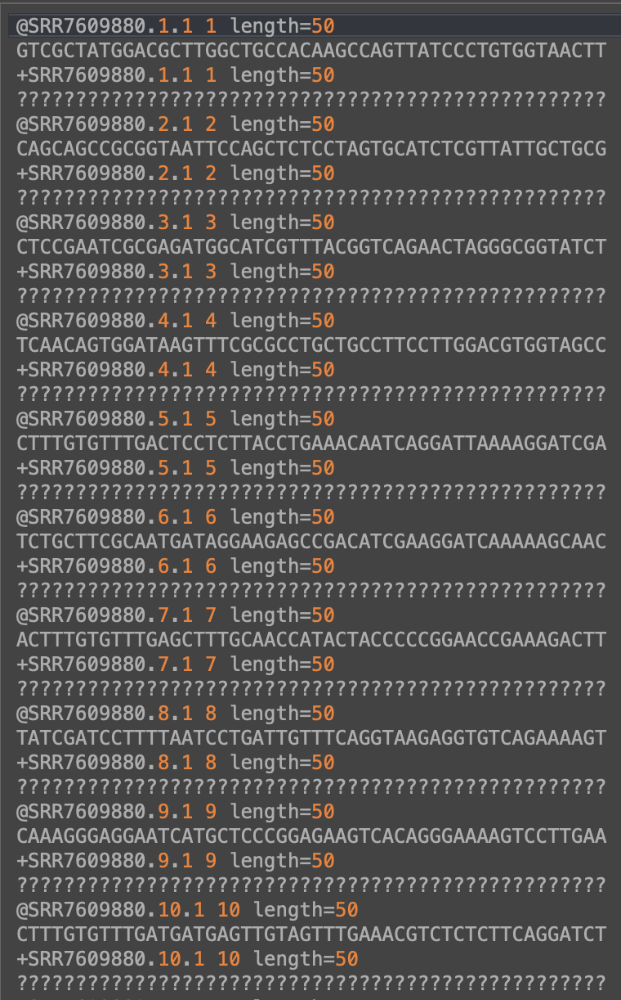

```{r setup, include=FALSE}
knitr::opts_chunk$set(echo = TRUE, error = TRUE, warning = FALSE)
```
---

```{r}
getwd() # find our current working directory 

setwd("/Users/jessicahill/Library/CloudStorage/OneDrive-Colostate/JESSICA/CSU/BMB/ONISH_LAB/PROJECTS/PROGRAMMING/Intro_qCMB_class/2023_qCMB_class") # set the directory we want as our current working directory 
```

---

### Quick Survey

How many of you have worked with a biological database before? 

Which one(s)? 

---

### Biological Databases

As biological data accumulate at larger scales and increase at exponential paces, the number of biological databases (libraries or repositories) that have been developed to manage such data are growing at ever-faster rates. 

> Data can be in the form of: 

* nucleic acids (DNA and RNA) --> genomics assays
* proteins --> proteomics assays 
* small molecules --> metabolomics assays 

```{r echo=FALSE, out.width = "90%", fig.align = "center"}
#install.packages("imager")
library(imager)

knitr::include_graphics("./GrowthOfDNASequencing.png")
```

[Paper for the sfigure above](https://journals.plos.org/plosbiology/article?id=10.1371/journal.pbio.1002195)

A biological database is an organized collection of data, usually assembled using software particularly designed to organize, query, update and retrieve the data.

The primary objective of biological databases is not just to store, organize, and share data in a structured and searchable manner with the aim to facilitate data retrieval and visualization, but also to provide web application programming interfaces for computers to exchange and integrate data from various database resources in an automated manner.

> Databases are classified into 5 major categories:

* Primary: stores raw information in the form of sequences and structures.

* Composite: combine various databases at a single platform; they contain a search algorithm. 

* Secondary: contain derived information from primary databases; derived information being information that is the outcome of the analysis of data from primary databases. 

* Structural: contain structural data, like 3D crystal structures obtained from NMR or X-ray crystallography. 

* Specialized: include several different types of specialized databases such as clustering databases, bibliographic databases, and expression databases. 

```{r echo=FALSE, out.width = "90%", fig.align = "center"}

```

[Paper for the figure above](https://www.sciencedirect.com/science/article/pii/B9780323897754000213)

---

### Example Biological Databases

1. [Mouse Genome Informatics](http://www.informatics.jax.org/)
2. [Human Microbiome Project](https://hmpdacc.org/)
3. [UCSC Genome Browser](https://genome.ucsc.edu/)
4. [ATCC Genome Portal](https://genomes.atcc.org/?_ga=2.36707625.827873597.1643044790-1176553054.1640723221)
5. [Human Genome Resources at NCBI](https://www.ncbi.nlm.nih.gov/genome/guide/human/) 
6. [FlyBase](https://flybase.org/) 
7. [The Human Metabolome Database](https://hmdb.ca/)
8. [MicrobeNet](https://www.cdc.gov/microbenet/index.html)
9. [EnsemblBacteria](https://bacteria.ensembl.org/index.html)
10. [Microbial Genomes](https://www.ncbi.nlm.nih.gov/genome/microbes/)
11. [KEGG: Kyoto Encyclopedia of Genes and Genomes](https://www.genome.jp/kegg/)
12. [PubChem](https://pubchem.ncbi.nlm.nih.gov/)
13. [VIOLIN: Vaccine investigation and online information network](http://www.violinet.org/)
14. [SRA Database](https://www.ncbi.nlm.nih.gov/sra) 

---

### What type of questions can we ask with data from biological databases?

Any thoughts...?

- What genes/proteins are involved in water soluble vitamin digestion and absorption (i.e. B12) in mus musculus (the house mouse)?

- What vaccines are licensed for use in humans to prevent Polio?

- What is the genome of Pseudomonas aeruginosa and how similar is it to Pseudomonas fluorescens?

---

Lets look at an example using the paper ["Inflammation-associated gut microbiome in postacute sequelae of SARS-CoV-2 points towards new therapeutic targets" by Valdirene Leao Carneiro et al. 2023](https://gut.bmj.com/content/early/2023/01/29/gutjnl-2022-328757.long)

```
We read with interest the recent report by Liu et al describing faecal microbiome differences with postacute sequelae of SARS-CoV-2 (PASC), commonly referred to as ‘Long-COVID’. We have previously reported elevated levels of SARS-CoV-2-specific T cells with PASC compared with resolved COVID-19 (RC; no lingering symptoms at the time of sample collection) that correlated with increased levels of the inflammatory marker IL-6, suggesting that elevated inflammation in PASC may be related to immune response to residual virus.2 Although several studies have reported gut microbiome differences during acute COVID-19,3 PASC has received less attention. We, thus, sought to characterise gut microbiome differences in PASC versus RC using faecal samples from our study2 and to relate these differences to inflammation.
```

Now lets gather some data from this paper. To do this, we will visit [SRA](https://www.ncbi.nlm.nih.gov/sra/ERX9763720[accn]). 

The SRA (sequence read archive) houses sequencing data. You can search and download data from various published studies. 

Lets check out the 'how to search and download' section.

Now lets navigate to the papers data on SRA. We can use PRJEB56080 (bioproject ID) to search the particular project. 

---

Side exercise, downloading sequence data: 

FASTA files and FASTQ files store sequence data and sequence metadata. 

* FASTA files have the following format: 
    + A header line starting with >, containing the sequence ID.
    + One or more lines that contain the sequence.

* FASTQ files have the following format: 
    + A header line starting with @, containing the sequence ID.
    + One or more lines that contain the sequence.
    + A new line starting with the character +, and being either empty or repeating the sequence ID.
    + One or more lines that contain the quality scores.

```{r}
#if (!require("BiocManager", quietly = TRUE))
#    install.packages("BiocManager")

#BiocManager::install("ShortRead")
#library(ShortRead)

seq <- readFastq("./Example_Data/SRR7609880.fastq.gz", pattern=character(0))
sread(seq)
quality(seq)
id(seq)
```

```{r echo=FALSE, out.width = "90%", fig.align = "center"}

```

---

Now lets download the metadata that is available for this paper.

You will all need to either give the absolute path to where you downloaded the file on your computer, or use the relative path to point to this file which I added to our example data directory. 
```{r}
data <- read.table('./Example_Data/SraRunTable.txt', sep=",", header = T)
head(data)
```


time to interrogate
```{r}
summary(data) # someone tell me what this is doing?
str(data) 

# provide 2 ways to look up information on a function
```

you also see useful information in your R environment regarding this dataframe!

```{r}
dim(data) # gives dimensions (Row x Column)
nrow(data) # number of rows
ncol(data) # number of columns
names(data) # gives column names
head(data)
tail(data)
```

```{r}
IL_6 <- data$IL.6 # extract IL-6 data
IL.6 = data$IL.6

summary(IL_6)

plot(IL_6)
hist(IL_6)
boxplot(IL_6)
```

```{r}
CRP <- data$CRP
mean(CRP) # what happened?
print(CRP)

plot(CRP)
hist(CRP)
boxplot(CRP)

mean(CRP, na.rm = T) 
```

```{r}
var(CRP, na.rm = T) # gives us the variance in the data. Also shows some other useful functions

sd(CRP, na.rm = T) # gives us the standard deviation
```

```{r}
print(corr <- cor(x = IL_6, y = CRP, method = "pearson", use = "complete.obs"))
```

### Additional Resources

[R for Data Science](https://r4ds.hadley.nz/data-visualize.html)

[R Graphics](https://r-graphics.org/)

[R Gallery](https://r-graph-gallery.com/)
