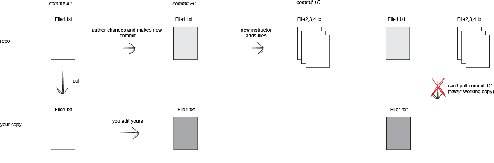
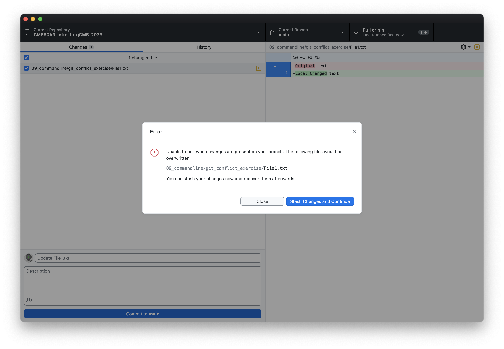
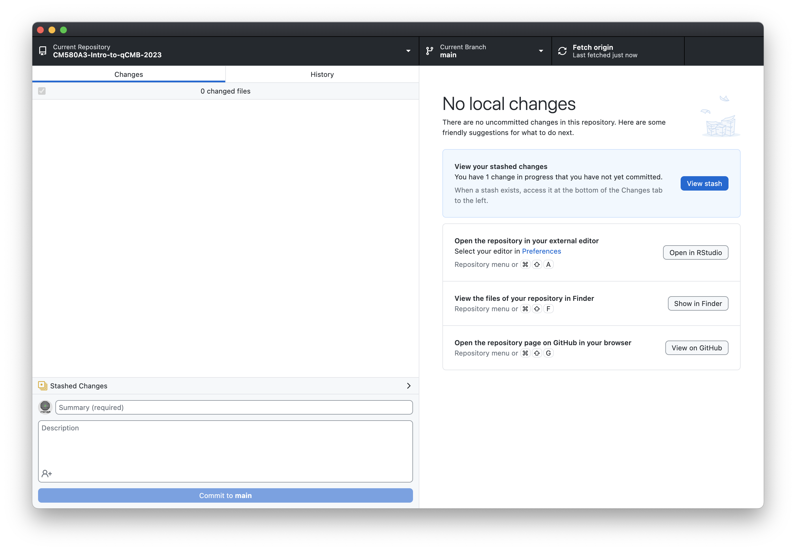

Over the course of working with a repository, it is possible to encounter conflicts by more than one person editing the same file.

In the context of this class, it is caused by:
  1. the content author (your instructors) changing the files after you pulled them, AND 
  1. you editing and saving the file yourself
 
### Illustration 

### Solutions

#### 1. Stash changes and pull (temporary)
  - Follow Github Desktop's prompt to `stash changes and continue`
  - It will pull, but you'll have to deal with the stash later
  

After stashing:

You'll now be able to pull as long as you ***don't make any more changes***

See [this link](https://docs.github.com/en/desktop/contributing-and-collaborating-using-github-desktop/making-changes-in-a-branch/stashing-changes) for another illustration of stashing.

#### 2. Make a copy and revert the conflicted file
  - Copy your file, change/add to the filename
  - Revert conflicted file (Discard Changes)

 
